[](https://github.com/ellerbrock/open-source-badges/)
[](https://opensource.org/licenses/mit-license.php)
[](CONTRIBUTING.md#pull-requests)
[](https://github.com/prettier/prettier)

Utdata fra lastejobb for Norske fylker og kommuner med egenskaper. Rene kartdata ligger i [kommune-kart](https://github.com/Artsdatabanken/kommune-kart).

## Dataflyt



### Datakilder (takk til)

- [Kartverket](https://kartverket.no)
- [Statistisk sentralbyrå](https://ssb.no)
- [Wikipedia](https://no.wikipedia.org)

### Lastejobb

- [kommune-lastejobb](https://github.com/Artsdatabanken/kommune-lastejobb)

### Bruk i sluttprodukter

- [Natur i Norge kart](https://github.com/Artsdatabanken/nin-kart-frontend)
- [Artsdatabanken åpne data](https://data.artsdatabanken.no/)

## Om datasettet

### Kommune

```json
{
  "item": "http://www.wikidata.org/entity/Q2415",
  "article": "https://no.wikipedia.org/wiki/Kristiansand",
  "url": "http://www.kristiansand.kommune.no/",
  "coa": "http://commons.wikimedia.org/wiki/Special:FilePath/Kristiansand%20komm.svg",
  "itemLabel": "Kristiansand",
  "code": "1001",
  "naboer": ["0926", "0928", "1014", "1017", "1018"],
  "images": [
    "http://commons.wikimedia.org/wiki/Special:FilePath/Kristiansand%2C%20Norway.jpg"
  ],
  "banners": [
    "http://commons.wikimedia.org/wiki/Special:FilePath/Bannerkristiansand.JPG"
  ]
}
```

### Fylke

```json
{
  "item": "http://www.wikidata.org/entity/Q585",
  "article": "https://no.wikipedia.org/wiki/Oslo",
  "code": "NO-03",
  "url": "http://www.oslo.kommune.no/",
  "coa": "http://commons.wikimedia.org/wiki/Special:FilePath/Oslo%20komm.svg",
  "banner": "http://commons.wikimedia.org/wiki/Special:FilePath/Oslo%20banner%20Akershus%20castle.jpg",
  "osm": "2775550",
  "inception": "1048-01-01T00:00:00.000Z",
  "elevation": 23,
  "flag": "http://commons.wikimedia.org/wiki/Special:FilePath/Flag%20of%20Oslo.svg",
  "itemLabel": "Oslo",
  "naboer": ["NO-02", "NO-05", "NO-06"],
  "images": [
    "http://commons.wikimedia.org/wiki/Special:FilePath/Oslo%20city%20in%2010%20images.jpg"
  ],
  "banners": [
    "http://commons.wikimedia.org/wiki/Special:FilePath/Oslo%20banner%20Akershus%20castle.jpg"
  ]
}
```
